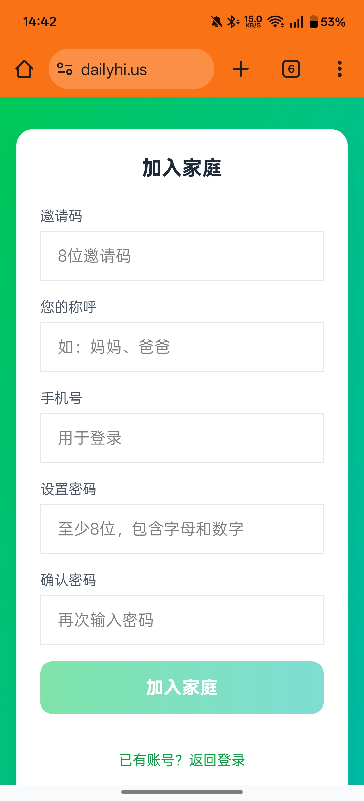
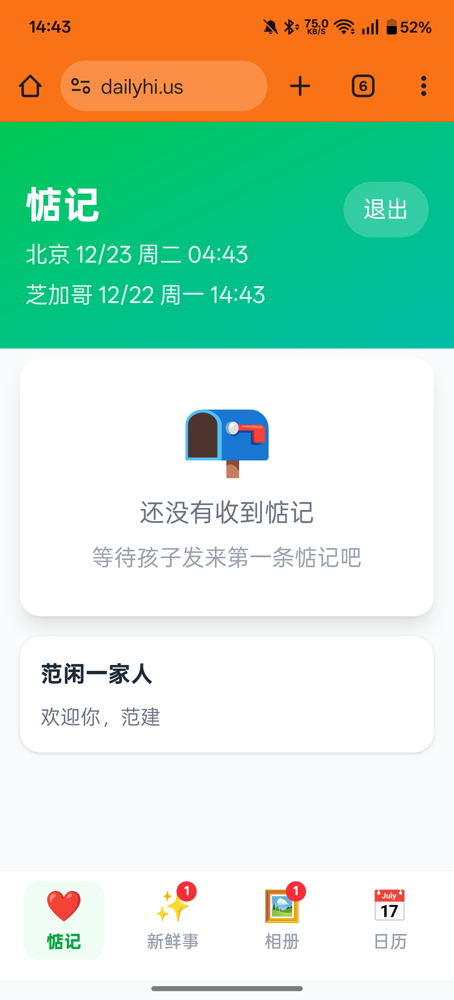

<p align="center">
  
</p>

<h1 align="center">惦记 (Thinking of You)</h1>

<p align="center">
  <strong>跨国家庭轻量陪伴工具 | Web PWA | Cloudflare 全栈</strong><br>
  <em>A lightweight companion tool for transnational families | Web PWA | Cloudflare Full-Stack</em>
</p>

<p align="center">
  让海外子女用最轻的方式，给国内父母最重的惦记。<br>
  <em>The lightest way for overseas children to send the deepest care to parents back home.</em>
</p>

<p align="center">
  <a href="https://dailyhi.us"><strong>Demo: https://dailyhi.us</strong></a>
</p>

## 截图预览

### 子女端

<table>
  <tr>
    <td align="center"><br/><b>注册</b></td>
    <td align="center"><br/><b>每日惦记</b></td>
    <td align="center"><br/><b>发布新鲜事</b></td>
  </tr>
  <tr>
    <td align="center"><br/><b>选择宝贝</b></td>
    <td align="center"><br/><b>宝贝相册</b></td>
    <td align="center"><br/><b>惦记日历</b></td>
  </tr>
</table>

### 父母端

<table>
  <tr>
    <td align="center"><br/><b>加入家庭</b></td>
    <td align="center"><br/><b>等待惦记</b></td>
    <td align="center"><br/><b>新鲜事</b></td>
  </tr>
  <tr>
    <td align="center"><br/><b>宝贝相册</b></td>
    <td align="center"><br/><b>惦记日历</b></td>
    <td></td>
  </tr>
</table>

## 功能特性

- **每日惦记** - 3秒完成一次心情签到，降低沟通门槛
- **语音惦记** - 子女可录制语音发布新鲜事，父母可录制语音回复
- **新鲜事** - 分享生活动态，支持图片、语音、位置和评论互动
- **宝贝相册** - 专属孙辈照片墙，支持"想看"请求
- **惦记日历** - 月历视图，连续签到统计，历史回顾
- **未读提醒** - 新消息红点提示，不错过每一次惦记
- **角色自适应 UI** - 父母端大字体、大按钮，子女端清新简洁
- **双时区显示** - 同时显示北京和所在地时间
- **PWA 支持** - 可安装到手机桌面，接近原生体验

## 技术栈

| 层级 | 技术 |
|------|------|
| 前端 | React 19 + TypeScript + Tailwind CSS v4 + Vite |
| 后端 | Hono + Cloudflare Workers |
| 数据库 | Cloudflare D1 (SQLite) |
| 存储 | Cloudflare R2 |
| 认证 | JWT (Access + Refresh Token) |
| 部署 | Cloudflare Pages + Workers |

## 为什么选择 Cloudflare 全托管？

**零成本部署** - Cloudflare 免费套餐完全够用：

| 服务 | 免费额度 | 说明 |
|------|----------|------|
| Workers | 10万次请求/天 | 后端 API，无冷启动 |
| Pages | 无限静态托管 | 前端 PWA |
| D1 | 5GB 存储 + 500万行读/天 | SQLite 数据库 |
| R2 | 10GB 存储 + 100万次读/月 | 图片/音频存储，无出口费用 |

**全托管优势：**
- 无需管理服务器、无需运维、自动扩缩容
- 全球边缘部署，国内外访问都快
- 自带 HTTPS 和 DDoS 防护
- 域名可选 - 默认提供 `*.pages.dev` 免费子域名

> 对于家庭使用场景，Cloudflare 免费套餐绰绰有余，真正实现**零成本**运行。

## 项目结构

```
thinking-of-you/
├── frontend/              # React + Vite PWA
│   ├── src/
│   │   ├── components/    # UI 组件
│   │   │   ├── auth/      # 登录/注册
│   │   │   ├── child/     # 子女端组件
│   │   │   ├── parent/    # 父母端组件
│   │   │   └── shared/    # 共享组件（导航栏等）
│   │   ├── pages/         # 页面组件
│   │   ├── hooks/         # 自定义 Hooks (useAuth)
│   │   ├── lib/           # API 客户端
│   │   └── types/         # TypeScript 类型定义
│   └── public/            # PWA 图标和 manifest
├── backend/               # Cloudflare Workers API
│   ├── src/
│   │   ├── routes/        # API 路由模块
│   │   │   ├── auth.ts    # 认证（登录/注册/刷新）
│   │   │   ├── checkin.ts # 惦记签到
│   │   │   ├── moments.ts # 新鲜事
│   │   │   ├── album.ts   # 相册
│   │   │   ├── family.ts  # 家庭管理
│   │   │   └── upload.ts  # 文件上传
│   │   ├── middleware/    # 认证中间件
│   │   ├── utils/         # 工具函数
│   │   └── types.ts       # 类型定义
│   ├── schema.sql         # 数据库 Schema
│   └── wrangler.toml      # Cloudflare 配置
└── package.json           # Monorepo 配置
```

## 本地开发

### 环境要求

- Node.js 18+
- npm 或 pnpm
- Wrangler CLI (`npm install -g wrangler`)

### 1. 克隆项目

```bash
git clone https://github.com/alps99/thinking-of-you.git
cd thinking-of-you
```

### 2. 安装依赖

```bash
npm install
```

### 3. 初始化本地数据库

```bash
cd backend
npx wrangler d1 execute dianji-db --local --file=./schema.sql
```

### 4. 设置本地 JWT 密钥

创建 `backend/.dev.vars` 文件：

```bash
echo 'JWT_SECRET="your-development-secret-key"' > backend/.dev.vars
```

### 5. 启动开发服务器

```bash
npm run dev
```

- 前端: http://localhost:5173
- 后端: http://localhost:8787

## 部署

### 前置条件

- Cloudflare 账号
- 登录 Wrangler: `npx wrangler login`

### 1. 创建 Cloudflare 资源

```bash
cd backend

# 创建 D1 数据库
npx wrangler d1 create dianji-db
# 记录输出的 database_id

# 创建 R2 存储桶
npx wrangler r2 bucket create dianji-media

# 创建 KV 命名空间
npx wrangler kv namespace create dianji-kv
# 记录输出的 id
```

### 2. 配置 wrangler.toml

编辑 `backend/wrangler.toml`，填入创建的资源 ID：

```toml
name = "your-api-name"

[vars]
APP_NAME = "惦记"
APP_URL = "https://your-frontend-domain.com"

[[d1_databases]]
binding = "DB"
database_name = "dianji-db"
database_id = "<YOUR_D1_DATABASE_ID>"

[[r2_buckets]]
binding = "R2"
bucket_name = "dianji-media"

[[kv_namespaces]]
binding = "KV"
id = "<YOUR_KV_NAMESPACE_ID>"
```

### 3. 部署后端

```bash
cd backend

# 设置 JWT 密钥（建议用 openssl rand -base64 32 生成）
npx wrangler secret put JWT_SECRET

# 初始化远程数据库
npx wrangler d1 execute dianji-db --remote --file=./schema.sql

# 部署 Worker
npx wrangler deploy
```

### 4. 配置前端环境变量

创建 `frontend/.env.production`：

```bash
VITE_API_URL=https://your-api-name.your-subdomain.workers.dev
```

### 5. 部署前端

```bash
cd frontend

# 构建
npm run build

# 部署到 Pages
npx wrangler pages deploy dist --project-name=your-project-name
```

### 6. 更新 CORS

将前端域名更新到 `wrangler.toml` 的 `APP_URL`，重新部署后端。

## API 文档

### 认证

| 方法 | 路径 | 描述 |
|------|------|------|
| POST | /api/auth/register/child | 子女注册（创建家庭） |
| POST | /api/auth/register/parent | 父母注册（加入家庭） |
| POST | /api/auth/login | 登录 |
| POST | /api/auth/logout | 登出 |
| GET | /api/auth/me | 获取当前用户信息 |

### 惦记

| 方法 | 路径 | 描述 |
|------|------|------|
| POST | /api/checkins | 发送惦记（子女） |
| GET | /api/checkins/today | 获取今日惦记 |
| GET | /api/checkins/latest | 获取最新惦记 |
| POST | /api/checkins/:id/respond | 回应惦记（父母） |
| GET | /api/checkins/calendar | 获取日历数据 |

### 新鲜事

| 方法 | 路径 | 描述 |
|------|------|------|
| GET | /api/moments | 获取新鲜事列表 |
| POST | /api/moments | 发布新鲜事 |
| POST | /api/moments/:id/react | 互动（点赞/语音） |
| POST | /api/moments/:id/comment | 评论 |
| GET | /api/moments/unread-count | 获取未读数量 |

### 相册

| 方法 | 路径 | 描述 |
|------|------|------|
| GET | /api/album/grandchildren | 获取宝贝列表 |
| POST | /api/album/grandchildren | 添加宝贝 |
| GET | /api/album/photos | 获取照片 |
| POST | /api/album/photos | 上传照片 |
| POST | /api/album/request | 发起"想看"请求 |

## 安全说明

- JWT 密钥通过 Cloudflare Secrets 管理，不会出现在代码中
- 所有敏感配置已加入 `.gitignore`
- D1 数据库 ID 和 KV 命名空间 ID 不属于敏感信息
- R2 存储通过签名 URL 访问，无公开暴露

## 贡献

欢迎提交 Issue 和 Pull Request！

1. Fork 本仓库
2. 创建功能分支 (`git checkout -b feature/amazing-feature`)
3. 提交更改 (`git commit -m 'Add amazing feature'`)
4. 推送到分支 (`git push origin feature/amazing-feature`)
5. 创建 Pull Request

## 许可证

MIT License - 详见 [LICENSE](LICENSE) 文件

## 作者

[Alps](https://github.com/alps99)

---

如果这个项目对你有帮助，欢迎 Star 支持！
